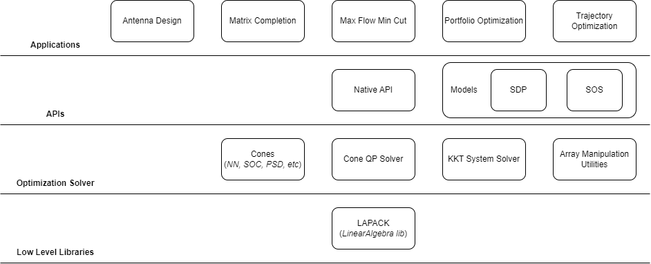

# Design

## Features
- Solves [LP](https://en.wikipedia.org/wiki/Linear_programming) (Linear Programming), [QP](https://en.wikipedia.org/wiki/Quadratic_programming) (Quadratic Programming), [SOCP](https://en.wikipedia.org/wiki/Second-order_cone_programming) (Second Order Cone Programming) and [SDP](https://en.wikipedia.org/wiki/Semidefinite_programming) (Semidefinite Programming) problems
- Supports Nonnegative Orthant, Second Order and Positive Semidefinite cone types
- Minimal project dependencies (mainly [LAPACK](https://www.netlib.org/lapack/))
- Implements common array manipulation operations to reduce complexity in defining optimization problems
- Can define Semidefinite and [Sum of Squares](https://en.wikipedia.org/wiki/Sum-of-squares_optimization) problems with ease using predefined models
- Modular (by design) so users can bring their own [KKT](https://en.wikipedia.org/wiki/Karush%E2%80%93Kuhn%E2%80%93Tucker_conditions) (Karush Kuhn Tucker) solver to utilize sparsity patterns and problem structure for optimal solver performance
- Open source ([MIT License](https://en.wikipedia.org/wiki/MIT_License))
- Several scientific and engineering examples ready to be extended for real world application
- Native conic solver interface, reduce overhead associated with using dependencies when defining an optimization problem

## Components
All example applications extend from either the native or model based APIs. The rank minimization (matrix completion) example (for example) uses the SDP model and trajectory optimization example uses the SOS model.

You may need to install further dependencies to run the specific examples. This modular approach allows the optimization solver to be **performant**, **extensible** for future emerging applications and **versatile** so it is suitable for solving large-scale problems or real-time embedded problems for example.

The high-level component diagram (see below) can serve as a guide for users and developers working with the project codebase.

