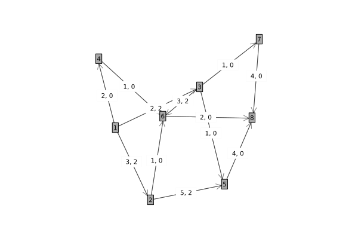

# Maximum Flow Minimum Cut

## Introduction

Max flow min cut problems have multidisciplinary applications and commonly discussed due to pedagogical purposes. The problem is to maximize the flow (or throughput) of some quantity such as network data from a given source node to a destination node subject to capacity constraints between the nodes in the graph. This problem is an LP problem which has a natural conic formulation.

## How to run the example

1. Ensure that you have ConicSolve installed. This can be installed as follows:
```julia
julia> ]
pkg> activate .
pkg> add ConicSolve
julia> exit()
```

2. Run the example from the command line
```bash
julia example.jl
```

### Explanation
Assume we have the network graph below:


The adjacency matrix can be formed from the non-zero entries in the matrix of capacities between nodes, i.e.
```math
G = \begin{bmatrix}
0 & 3 & 2 & 2 & 0 & 0 & 0 & 0 \\
0 & 0 & 0 & 0 & 5 & 1 & 0 & 0 \\
0 & 0 & 0 & 0 & 1 & 3 & 1 & 0 \\
0 & 0 & 0 & 0 & 0 & 1 & 0 & 0 \\
0 & 0 & 0 & 0 & 0 & 0 & 0 & 4 \\
0 & 0 & 0 & 0 & 0 & 0 & 0 & 2 \\
0 & 0 & 0 & 0 & 0 & 0 & 0 & 4 \\
0 & 0 & 0 & 0 & 0 & 0 & 0 & 0
\end{bmatrix}
```
For example, the (1, 2) entry corresponds to a capacity of 3 and a minimum capacity of 2 from node 1 (row 1) to node 2 (column 2).

#### Data Acquisition
This is a simple toy problem setup. No data has been imported in this example.

#### Solve the problem

(i) We create a ConeQP object that represents the LP problem to solve `cone_qp = get_qp(G, min_G)`.

(ii) We pass the ConeQP object to the solver `solver = Solver(cone_qp)`.

(iii) Then when we're ready we call optimize! passing the solver object `optimize!(solver)`.

(iv) We can access the solution by accessing the primal solution from the solver `x = get_solution(solver)`.

#### Get the solution

#### Further Comments