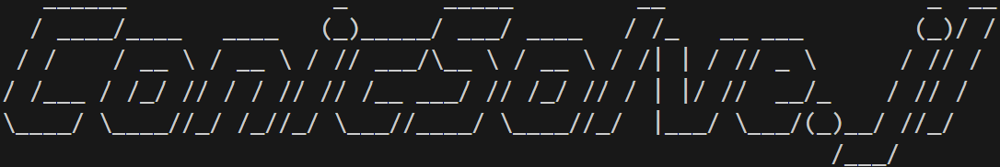

```@raw html

```

# Introduction

ConicSolve.jl is a Primal-Dual Interior-Point method constrained optimization solver based on the paper [Vandenberghe, 2010, The CVXOPT linear and quadratic cone program solvers](https://www.seas.ucla.edu/~vandenbe/publications/coneprog.pdf). It can be used to solve several problem classes including LP (Linear Program), QP (Quadratic Program) and SDP (Semidefinite Program).

!!! warning
    This solver is experimental, APIs and implementation are subject to change without notice. The solver has not been rigorously tested, may contain bugs and numerical stability issues.

The solver requires that problems be expressed as a cone quadratic program (cone QP) i.e. in the form
```math
\begin{aligned}
\text{minimize}\qquad &
(1/2)x^TPx + c^Tx \\
\text{subject to}\qquad &
Gx + s = h \\
& Ax = b \\
& s \succeq 0
\end{aligned}
```
where ``P`` is a PSD (positive semidefinite) matrix, ``s`` is a generalized inequality with respect to a self-dual convex cone.

## Installation

To use ConicSolve.jl, install [Julia](https://julialang.org/downloads/), then at the Julia REPL, type:

```julia
using Pkg
Pkg.add("ConicSolve")
using ConicSolve
```

# How to use
There are two ways to construct an optimization problem in ConicSolve.jl
1. Declarative API
2. Using the Low Level API

### Using the Declarative API
The declarative API requires problems be expressed in the form
```math
\begin{aligned}
\text{minimize}\qquad &
(1/2)x^TPx + c^Tx \\
\text{subject to}\qquad &
Ax = b \\
& x \succeq 0
\end{aligned}
```
As an example, the following constrained optimization feasiblity problem
```math
\begin{aligned}
\text{minimize}\qquad &
0 \\
\text{subject to}\qquad &
x_{1} + x_{4} + x_{6} + x_{7} + x_{10} + x_{12} = 1 \\
& x_{2} + x_{4} + x_{6} + x_{8} + x_{9} + x_{10} + x_{12} = 2 \\
& x_{3} + x_{4} + x_{6} + x_{7} + x_{10} + x_{12} = 4 \\
& [x_{1}, x_{2}, x_{3}, x_{4}, x_{5}, x_{6}] \in R_+^6 \\
& \begin{bmatrix}
x_{7} & x_{8} & x_{9} \\
x_{8} & x_{10} & x_{11} \\
x_{9} & x_{11} & x_{12}
\end{bmatrix} \in S_+^3
\end{aligned}
```
can be expressed declaratively as
```julia
julia> program = ConeQP()

julia> x1 = add_variable(program, NonNegativeOrthant(6), 6)
julia> x2 = add_variable(program, PSDCone(3), 3)

julia> A1::Matrix{Float64} = [1. 0. 0. 1. 0. 1.;
    0. 1. 0. 1. 0. 1.;
    0. 0. 1. 1. 0. 1.]
julia> A2::Matrix{Float64} = [1. 0. 0. 1. 0. 1.;
    0. 1. 1. 1. 0. 1.;
    1. 0. 0. 1. 0. 1.]
julia> b::Vector{Float64} = [1., 2., 4.]

julia> define_program(program,
            (A1 * x1) + (A2 * x2) == b)
julia> program = build_program(program)
julia> solver = Solver(program)
julia> run_solver(solver)
```

### Using the Low Level API
Alternatively, cone programs can be defined by supplying the raw solver matrices and vectors. Below is an example of how to use the Low Level API
```julia
julia> using ConicSolve
julia> p_1 = 16 # for example, 16 x 16 SDP matrix
julia> p_2 = 136 # for example, 136 elements (or 16 * 17 / 2) in lower triangular SDP matrix
julia> A = [] # problem specific, replace with your values
julia> G = [] # problem specific, replace with your values
julia> P = [] # problem specific, replace with your values
julia> b = [] # problem specific, replace with your values
julia> c = [] # problem specific, replace with your values
julia> h = [] # problem specific, replace with your values
julia> cones::Vector{Cone} = []
julia> push!(cones, PSDCone(p_1))
julia> push!(cones, NonNegativeOrthant(p_2))
julia> cone_qp = ConeQP(A, G, P, b, c, h, cones)
julia> solver = Solver(cone_qp)
julia> run_solver(solver)
```

### Using a model
Models serve two purposes:
- To provide a means to represent specific types of cone programs
- To provide a common set of subroutines to construct cone programs

An example of using an SDP model to construct a cone program is given below
```julia
julia> using ConicSolve
julia> data = [] # your data here
julia> mask = [] # your data here
julia> sdp = SDP(data)
julia> set_values(sdp, mask)
julia> set_nonnegative_constraint(sdp)
julia> c = get_trace(sdp)
julia> set_objective(sdp, c)
julia> qp = get_qp(sdp)
julia> solver = Solver(qp)
julia> run_solver(solver)
```

# Examples

In the examples directory you will find several examples which gives an idea of how to use the API for this solver.

# How to cite
```bibtex
@misc{Leong2025,
    title = {ConicSolve: A constrained optimization solver for scientific advancement},
    author = {Alexander Leong},
    url = {https://github.com/alexander-leong/ConicSolve.jl}
}
```

### GPU Acceleration

ConicSolve.jl uses CUDA.jl to accelerate matrix factorization methods for solving the KKT equations. Refer to [CUDA.jl](https://cuda.juliagpu.org/stable/installation/overview/) for additional installation requirements.

Note: \
GPU Acceleration from running ConicSolve.jl as a standalone binary executable is currently not supported.

Enable GPU acceleration via the following code snippet
```julia
using CUDA
using ConicSolve
```

Ensure the solver property `solver.device = GPU` has been set.

# Contributions

This solver has been developed for the sole purpose of investigating new and existing applications for Interior Point based methods by creating a solver that has minimal project dependencies, is highly performant, general purpose, extensible and most importantly is free for public use.

This project is still a work in progress. Any contributions to add additional examples and use cases are welcome! Even if you can't contribute, please consider providing financial assistance if you have found this project useful in your work.

# Reference Material

```@raw html
<a href="./assets/ConicSolve.pdf">Project Poster
```

# License
MIT License

Copyright (c) 2025 Alexander Leong

Permission is hereby granted, free of charge, to any person obtaining a copy
of this software and associated documentation files (the "Software"), to deal
in the Software without restriction, including without limitation the rights
to use, copy, modify, merge, publish, distribute, sublicense, and/or sell
copies of the Software, and to permit persons to whom the Software is
furnished to do so, subject to the following conditions:

The above copyright notice and this permission notice shall be included in all
copies or substantial portions of the Software.

THE SOFTWARE IS PROVIDED "AS IS", WITHOUT WARRANTY OF ANY KIND, EXPRESS OR
IMPLIED, INCLUDING BUT NOT LIMITED TO THE WARRANTIES OF MERCHANTABILITY,
FITNESS FOR A PARTICULAR PURPOSE AND NONINFRINGEMENT. IN NO EVENT SHALL THE
AUTHORS OR COPYRIGHT HOLDERS BE LIABLE FOR ANY CLAIM, DAMAGES OR OTHER
LIABILITY, WHETHER IN AN ACTION OF CONTRACT, TORT OR OTHERWISE, ARISING FROM,
OUT OF OR IN CONNECTION WITH THE SOFTWARE OR THE USE OR OTHER DEALINGS IN THE
SOFTWARE.