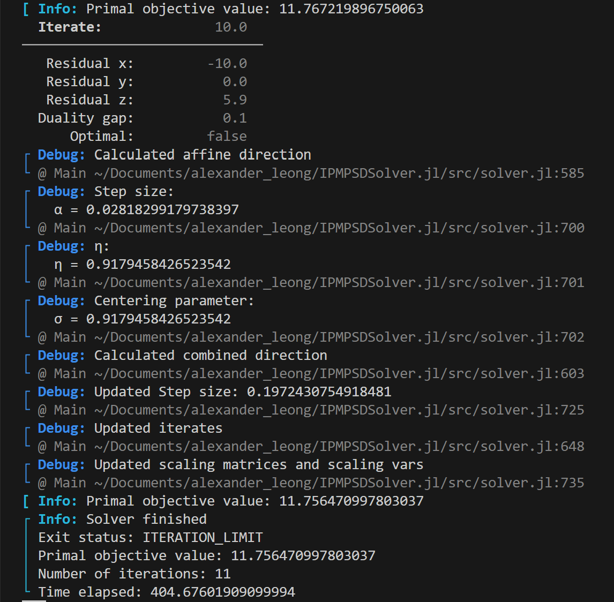

# Tutorial

## Running the image denoising example

1. Ensure that you have the necessary dependencies installed. These can be installed by executing the following commands:
```julia
julia> ]
pkg> activate .
pkg> add ColorTypes
pkg> add ImageFiltering
pkg> add TestImages

pkg> add ConicSolve
julia> exit()
```

2. Run the example from the command line
```bash
julia example.jl
```

3. Check the output from the console, you should see something like the following:

### Explanation

The image denoising example is an example application for solving a rank minimization problem. An image can be represented as a matrix. Here we're just going to take a patch of the image so our optimization problem doesn't get to unwieldy.

#### Data Acquisition
The image is usually corrupted by some noise. In this example we purposely corrupt this image using salt-pepper noise. To determine which pixels are noisy we'll pass the image through a Laplacian distribution filter. By some threshold will determine which noise pixels to recover. This is what `preprocess_data()` does which will return a matrix img containing the loaded image and noise, the image mask where a value of 1 represents a noise pixel.

#### Solve the problem
We're going to attempt to recover the missing data by denoising the image through rank minimization. Just like was described in section [Using an SDP Model](./index.md);

(i) We create a ConeQP object that represents the rank minimization problem to solve `cone_qp = denoise_image(img, noise)`.

(ii) We pass the ConeQP object to the solver `solver = Solver(cone_qp)`.

(iii) Then when we're ready we call optimize! passing the solver object `optimize!(solver)`.

(iv) We can access the solution by accessing the primal solution from the solver `x = get_solution(solver)`.

(v) However because x is the lower triangular part of the SDP matrix we need to index into the matrix to get back our image. This is easily done by calling the function like so `output_img = get_X1(sdp, x)`.

#### Get the solution
How do we know we solved the problem? Well, inspecting the output we observe a couple of things:
- We obtain a duality gap of zero (or close to zero), this suggests that the solution we obtained is optimal.
- The x residual ``r_x``, y residual ``r_y``, z residual ``r_z`` are close to zero, this means we satisfied the primal and dual feasibility conditions.
- The residuals, duality gap and objective values do not change much after successive iterations.
```@raw html

```

Once primal feasibility is achieved in this particular example, we ensure that pixel values are nonnegative ``x >= 0`` and the non noise pixels are preserved ``Ax = b``.

#### Further Comments
Many optimization problems are not easy to solve and solvers including this one can run into numerical stability and performance issues. It is worthwhile exploring different parameter settings and reformulating the problem being solved in the event that these become issues.

NOTE: We should bound ``0 <= x <= 1`` since pixel values shouldn't be larger than one but leave this as an exercise to the reader.